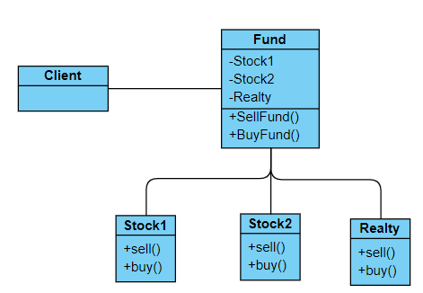

## 类图

## 外观模式定义
为了子系统中的一组接口提供一个一致的界面，此模式定义了一个高层接口，这个接口使得子系统更加容易使用。

## 使用场景
1. 设计初期阶段，有意识将两个不同的层分离
2. 开发阶段，子系统往往因为不断重构变得越来越复杂，增加外观可以提供一个简单的接口，减少彼此之间的依赖
3. 维护大型系统，系统难以维护和扩展，可以开发一个外观类，提供设计出错或者高度复杂的遗留代码的比较清晰简单的接口，让新系统与Facade对象进行交互，Facade与遗留代码交互所有复杂的工作。